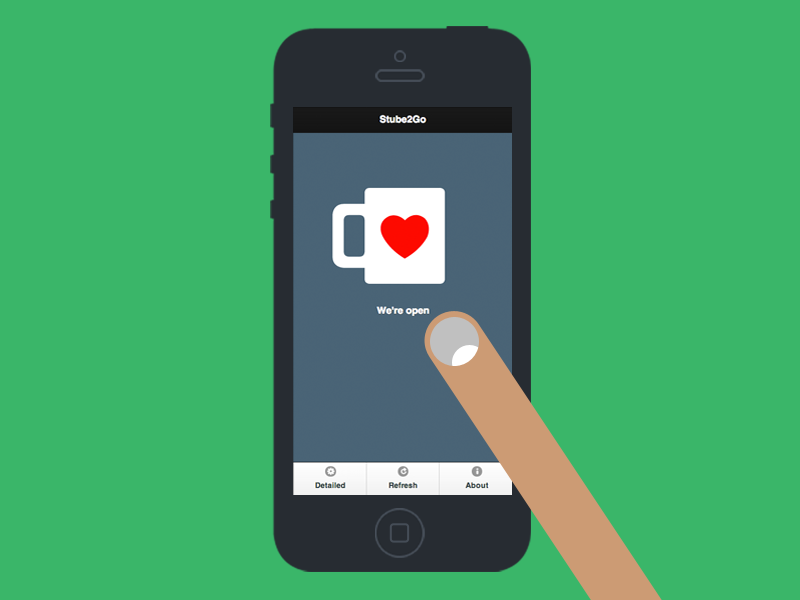

# stube2go
---
##### Interactive Prototyping | KISD Course 2012
 

**stube2go** is a automated system to offer your customers a convenient tool to check if your coffee-shop / bar / snack-shop is currently open and if the coffee-machine is ready for business. It's tailormade for the student's food & drink research-lab @ our University, but could be easily adapted to other needs or might be used as inspiration or didactical source. 

The project was done as an illustration of interaction design processes during an Interactive Prototyping course at [KISD, Köln International School of Design](http://kisd.de/).

**stube2go** provides an convenient way to check if the food&drinks-research-lab @ KISD, which is called "Gute Stube", is open for business. Therefor an Arduino-Ehternetboard with temperature-sensor is checking the heat of the portafilter espressomachine while a magnetic sensor is checking if the roller door is open. The Service is accessible via mobile App or as a Intranet & Wordpress - Plugin.

## Design Process & Included Areas 

1. Research & Design Concept
* UX & Interface Design
* Web-App coding
* Arduino C-Code JSONified
* Circuit prototyping
* Model making

## Participants
Christian Weeke, Dieter Pilger, Daniel Klose, Daniel Scharmach, Janno Ströcker, Jakob Samuel Kilian, Joana Francener Porto, Lukas Rauen, Louise Chi Yan Yau, Mariana Gonzalez Ruiz Velasco, Daniel Miebach, Michael Möckel, Allessandro Miraldi, Sebastian Schacht

**Supervision:** [David Grieshammer](http://dkgrieshammer.de/)  
**Hosting Professor:** [Andreas Muxel](http://www.andreasmuxel.com/)  
**App:** [stube2go.de](http://stube2go.de/)

---

##### Open Source Design, Hell yeah!